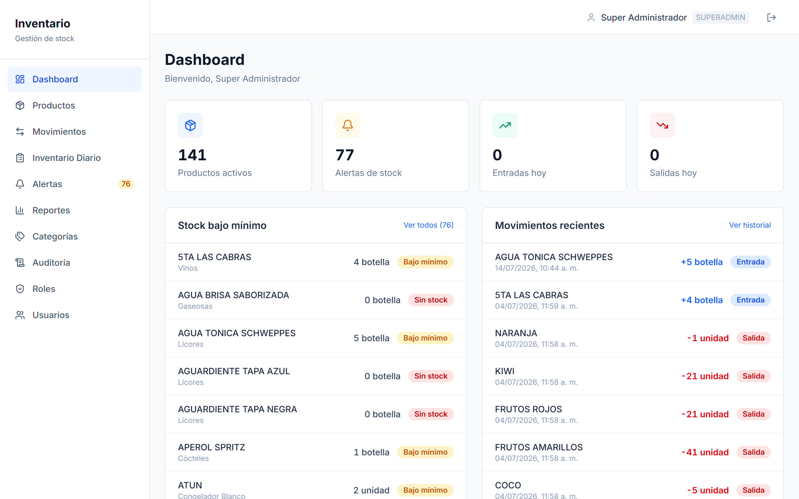
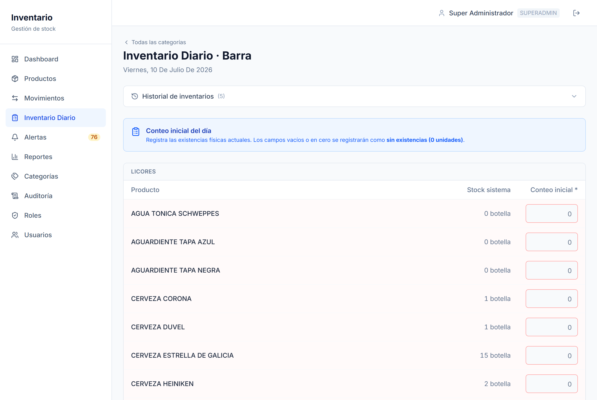
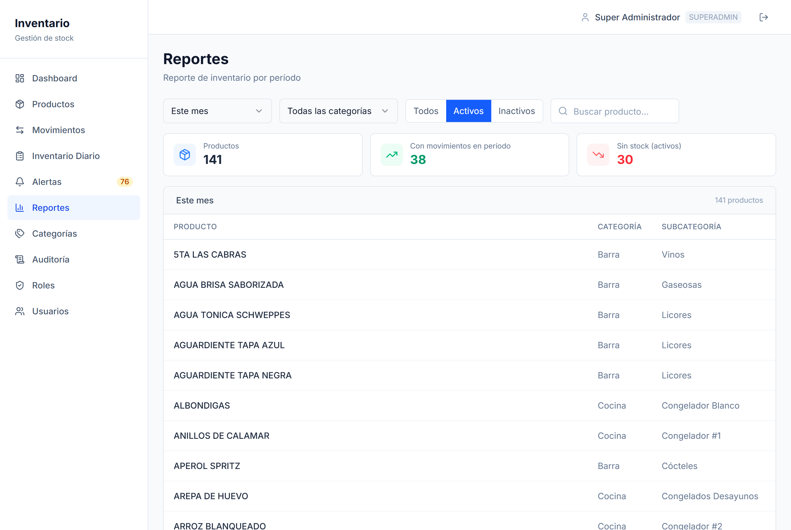
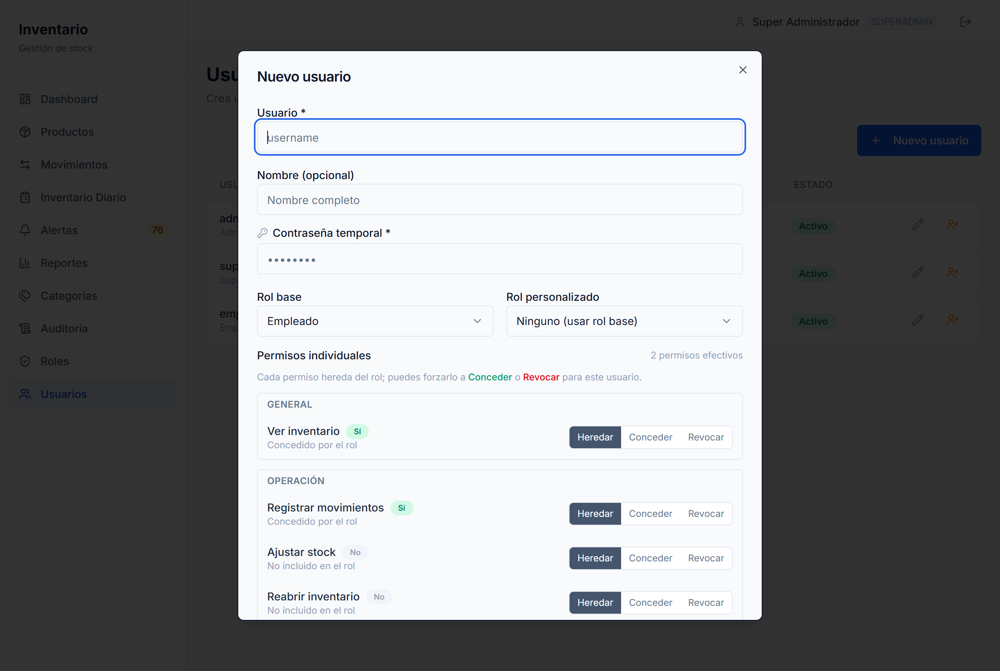
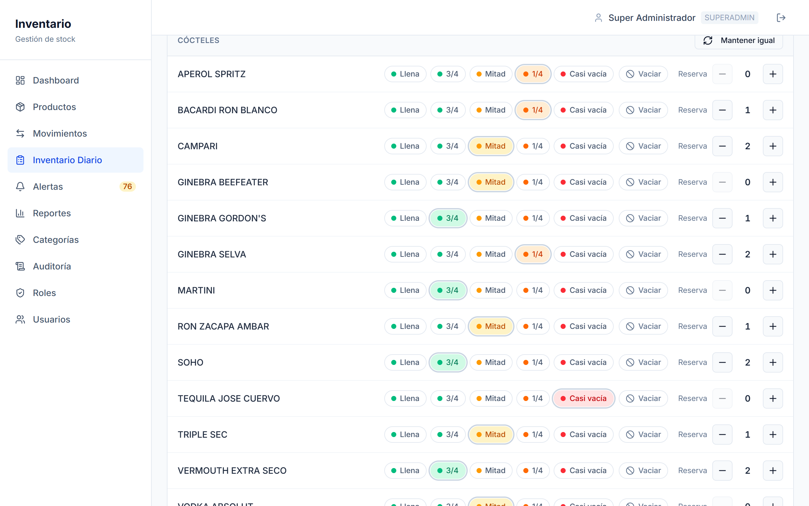

# Documentación Completa del Proyecto — Inventory Xpress

> Documento técnico para desarrolladores y mantenedores. Para el uso funcional del
> sistema por parte del cliente, ver [MANUAL_DE_USUARIO.md](MANUAL_DE_USUARIO.md).
> Última revisión de contenido contra el código: **2026-07-23** (incluye paginación/filtros de
> productos, edición y descarte de jornada abierta, cálculo de "Esperado", fracciones en
> conteos e indicador shots/copeo).

## Tabla de contenido

1. [Introducción general](#1-introducción-general)
2. [Objetivo del proyecto](#2-objetivo-del-proyecto)
3. [Alcance](#3-alcance)
4. [Visión general del sistema](#4-visión-general-del-sistema)
5. [Arquitectura](#5-arquitectura)
6. [Estructura de carpetas y archivos](#6-estructura-de-carpetas-y-archivos)
7. [Tecnologías y su propósito](#7-tecnologías-y-su-propósito)
8. [Dependencias principales](#8-dependencias-principales)
9. [Configuración del entorno](#9-configuración-del-entorno)
10. [Instalación](#10-instalación)
11. [Ejecución local](#11-ejecución-local)
12. [Base de datos](#12-base-de-datos)
13. [Módulos principales](#13-módulos-principales)
14. [Funcionalidades, una por una](#14-funcionalidades-una-por-una)
15. [Roles, permisos y restricciones](#15-roles-permisos-y-restricciones)
16. [Flujos de trabajo principales](#16-flujos-de-trabajo-principales)
17. [Reglas de negocio](#17-reglas-de-negocio)
18. [Validaciones importantes](#18-validaciones-importantes)
19. [Manejo de errores](#19-manejo-de-errores)
20. [Seguridad](#20-seguridad)
21. [Auditabilidad y trazabilidad](#21-auditabilidad-y-trazabilidad)
22. [Despliegue y producción](#22-despliegue-y-producción)
23. [Mantenimiento](#23-mantenimiento)
24. [Recomendaciones para futuros desarrolladores](#24-recomendaciones-para-futuros-desarrolladores)
25. [Limitaciones actuales](#25-limitaciones-actuales)
26. [Posibles mejoras futuras](#26-posibles-mejoras-futuras)
27. [Inconsistencias detectadas](#27-inconsistencias-detectadas)

---

## 1. Introducción general

**Inventory Xpress** es una aplicación web para la **gestión de inventario de
cualquier negocio** que necesite controlar el stock de sus insumos o productos:
tiendas, minimercados, bodegas, ferreterías, farmacias, bares, restaurantes,
cafeterías, etc. Permite organizar los productos en **categorías configurables**,
registrar **movimientos** de entrada/salida/ajuste, llevar un **conteo diario** por
área, emitir **alertas de reposición** y generar **reportes** por período. Incluye un
módulo de **auditoría** que registra las acciones sensibles del sistema.

El sistema **se despliega de forma independiente para cada cliente**: cada negocio
tiene su **propio despliegue y su propia base de datos**. Un único código base
(`main`) alimenta todos los despliegues; la diferencia entre clientes es
**configuración** (variables de entorno + un registro de clientes), nunca código.

> **Modelo de despliegue (importante):** no es un SaaS multi-tenant compartido (muchos
> clientes en una misma base). Cada cliente = una **base Turso** + un **proyecto Vercel**
> + un **dominio**, con aislamiento físico de datos.

El sistema funciona en dos modos de autenticación:

- **Standalone:** autenticación propia (usuarios en la base de datos local, login en `/login`).
- **Integrated:** sin login propio; valida el JWT de sesión emitido por **Nómina Xpress**
  (inicio de sesión único entre ambas aplicaciones), que actúa como **fuente de verdad
  de los permisos**.

## 2. Objetivo del proyecto

Dar a cualquier negocio una herramienta simple y confiable para saber **qué hay en
stock y cuánto** en todo momento, con soporte para:

- **Catálogo de productos** organizados en categorías y subcategorías configurables.
- **Movimientos** de entrada, salida y ajuste con trazabilidad de quién y cuándo.
- **Conteo diario** estructurado por área/categoría, que detecta discrepancias entre el
  stock del sistema y el conteo físico real.
- **Alertas** cuando un producto cae por debajo de su mínimo.
- **Reportes** de consumo/movimiento por período (semana, quincena, mes, histórico).
- **Control de acceso granular** por rol, rol personalizado y permiso individual.
- **Auditoría** de las acciones sensibles.
- Un **módulo opcional** de control por nivel de botella para productos embotellados que
  no se cuentan por unidad exacta (p. ej. licores; útil en bares/restaurantes).

## 3. Alcance

**Incluye:** autenticación (standalone o integrada), gestión de productos y categorías
jerárquicas, movimientos de stock (entrada/salida/ajuste), conteo/inventario diario por
categoría (apertura, cierre, reapertura, entradas y salidas no registradas), alertas de
stock bajo, reportes por período, auditoría con retención de 6 meses, gestión de
usuarios/roles/permisos (en modo standalone), modelo multi-cliente con feature flags por
instancia y backups per-cliente.

**Módulo opcional (feature flag `cocktails`, OFF por defecto):** control de productos
**por nivel de botella** (semáforo de 5 estados + botellas en reserva) en lugar de conteo
numérico. Está pensado para líquidos embotellados que duran varias semanas y no se miden
por unidad exacta (p. ej. licores de bar). Se activa por cliente cuando aplica.

**No incluye (fuera de alcance):** facturación, ventas o punto de venta (POS);
contabilidad; recetas o escandallos; medición en unidades continuas (mililitros, gramos)
con conversión; multi-tenancy con base de datos compartida (cada cliente usa una base
**física e independiente**); respaldo de imágenes de producto en el sistema de backups
actual (solo se respaldan las bases de datos).

## 4. Visión general del sistema

- **Un solo código base** (`main`) alimenta todos los despliegues; la diferencia entre
  clientes se configura **solo con variables de entorno** (branding, feature flags,
  credenciales) más el registro versionado `clients/registry.json`.
- **Base de datos por cliente:** cada cliente tiene su propia base **Turso (libSQL)** en
  producción (un único negocio por base); en local se usa un archivo SQLite
  (`file:./inventario.db`) con el mismo adapter.
- **Dos modos de autenticación** (`AUTH_MODE`): standalone (login propio) o integrated
  (JWT compartido con Nómina Xpress).
- **Dos funciones conmutables por cliente** (feature flags, OFF por defecto): `cocktails`
  (control por nivel de botella) y `dailyInventory` (flujo de conteo diario).

```
┌──────────────────────────────────────────────────────────────┐
│                  Navegador (cliente final)                     │
└───────────────┬──────────────────────────────────────────────┘
                │ HTTPS
┌───────────────▼──────────────────────────────────────────────┐
│                Next.js 16 (App Router) — Vercel                │
│                                                                │
│  proxy.ts (middleware)  → gate de sesión + acceso              │
│  Server Components       → leen datos con Prisma directamente  │
│  API Routes (/api/*)     → mutaciones, validan permisos        │
│  Client Components        → fetch a las API routes             │
│                                                                │
│  lib/: auth · permissions · roles · config · bottle · audit    │
└───────────────┬──────────────────────────────────────────────┘
                │ @prisma/adapter-libsql
┌───────────────▼──────────────────────────────────────────────┐
│         Base de datos: SQLite (local) / Turso (prod)           │
└────────────────────────────────────────────────────────────────┘

Integraciones externas:
- Nómina Xpress  → emite el JWT compartido (modo integrated)
- Vercel Blob    → almacena imágenes de productos
```

## 5. Arquitectura

### 5.1 Patrón general

Aplicación **Next.js 16 (App Router)** con renderizado del lado del servidor:

- Los **Server Components** leen de la base de datos **directamente** vía el cliente
  Prisma (`src/lib/db.ts`); nunca hacen `fetch` a una API route propia.
- Las **mutaciones** (crear/editar/borrar, registrar movimientos) van por **API routes**
  (`src/app/api/*`) invocadas desde componentes cliente.
- La **autorización fina** se resuelve en cada página/API contra los permisos efectivos;
  el middleware (`src/proxy.ts`) solo hace el *gating* grueso de acceso.

### 5.2 Modo de autenticación (`AUTH_MODE`)

| Valor | Comportamiento |
|---|---|
| `standalone` | Login propio en `/login`. Tabla `User` en la BD local. Los permisos se resuelven desde la BD en cada request (un cambio de rol aplica sin re-login). |
| `integrated` | Sin login propio. El middleware valida el JWT de Nómina Xpress (cookie compartida, mismo `NEXTAUTH_SECRET`). `userId`/`userName` de los movimientos se copian del JWT (no son claves foráneas). |

El modo se centraliza en `src/lib/config.ts` (`config.authMode`), que lee `process.env`
una sola vez y expone configuración tipada.

### 5.3 Capa de datos (Prisma 7 + libSQL)

Prisma 7 usa un motor "client" que requiere un **adapter**. Se usa
**`@prisma/adapter-libsql`** con **`@libsql/client`** para local y producción por igual
(`src/lib/db.ts`):

```ts
const adapter = new PrismaLibSql({
  url: process.env.TURSO_DATABASE_URL!,   // file:./inventario.db en local; libsql://… en prod
  authToken: process.env.TURSO_AUTH_TOKEN,
});
export const prisma = new PrismaClient({ adapter });
```

- El `schema.prisma` **no** define `url` en el `datasource` — la URL vive en
  `prisma.config.ts` (que lee `TURSO_DATABASE_URL ?? "file:./inventario.db"`).
- El cliente Prisma se genera en `src/generated/prisma/` (output custom; no editar a mano).
- En desarrollo, la instancia de Prisma se cachea en `globalThis` para evitar múltiples
  conexiones con el hot-reload.

### 5.4 Middleware (`src/proxy.ts`)

En Next.js 16 el middleware se llama `proxy.ts` (no `middleware.ts` en la raíz). Corre en
**edge runtime**, por lo que solo hace el *gating* grueso:

- Sin sesión → redirige a `/login` (standalone) o a `NOMINA_APP_URL/login` (integrated).
- Con sesión pero sin acceso efectivo (`canAccessInventory`) → redirige a `/unauthorized`.
- El control fino se resuelve en cada Server Component / API route contra la BD.

### 5.5 Flujo de datos (invariante clave)

`currentStock` **solo** se modifica dentro de una transacción Prisma que también crea el
`StockMovement` correspondiente. Nunca se actualiza el stock sin registrar el movimiento.

## 6. Estructura de carpetas y archivos

```
inventario-restaurante/
├── prisma/
│   ├── schema.prisma          # Modelo de datos (Category, Product, StockMovement, ...)
│   ├── seed.ts                # Datos iniciales: categorías demo + 3 usuarios por rol
│   └── backfill-*.ts          # Scripts puntuales de migración de datos
├── prisma.config.ts           # Config Prisma (URL de la BD, seed, migraciones)
├── clients/registry.json      # Índice de clientes (sin secretos)
├── scripts/
│   ├── provision-client.mjs   # Alta de cliente (crea BD Turso, schema, seed)
│   ├── db-dump.mjs / db-restore.mjs / db-verify.mjs   # Backups y restauración
│   ├── backup-preflight.mjs   # Chequeo registry ↔ DB_TARGETS
│   └── apply-turso-sql.mjs    # Aplica un .sql a una BD Turso
├── .github/workflows/backup-db.yml   # Backup semanal per-cliente
├── src/
│   ├── proxy.ts               # Middleware Next.js 16 (gate de sesión y acceso)
│   ├── app/
│   │   ├── (auth)/login/      # Login (solo standalone)
│   │   ├── (dashboard)/       # Rutas protegidas (shell sidebar + header)
│   │   │   ├── page.tsx        # Dashboard
│   │   │   ├── productos/      # Listado, alta y edición de productos
│   │   │   ├── movimientos/    # Registro e historial de movimientos
│   │   │   ├── inventario-diario/  # Conteo diario por categoría
│   │   │   ├── alertas/  reportes/  auditoria/  perfil/
│   │   │   └── admin/          # categorias / usuarios / roles
│   │   ├── api/                # API routes (ver §13.3)
│   │   └── unauthorized/       # Página de acceso denegado
│   ├── components/            # layout, products, movements, inventario, ui (shadcn/ui)
│   ├── lib/                   # auth, config, permissions, roles, bottle, audit, db, ...
│   ├── types/                 # next-auth.d.ts, index.ts
│   └── generated/prisma/      # Cliente Prisma generado (no editar)
├── docs/                      # Documentación (ver docs/README.md)
├── CLAUDE.md / AGENTS.md      # Instrucciones para asistentes de IA
└── README.md                  # Presentación y arranque rápido
```

## 7. Tecnologías y su propósito

| Tecnología | Propósito |
|---|---|
| **Next.js 16 (App Router)** | Framework full-stack: Server Components, API routes, middleware. |
| **TypeScript (strict)** | Tipado estricto, sin `any`; el contrato del JWT compartido depende de tipos correctos. |
| **Tailwind CSS v4 + shadcn/ui** | Estilos utilitarios y primitivas de UI accesibles (Radix). |
| **Prisma 7 ORM** | Acceso a datos tipado; motor "client" con adapter. |
| **libSQL / Turso** | Base de datos SQLite distribuida (una por cliente en prod); SQLite local en dev. |
| **NextAuth v5** | Autenticación (Credentials en standalone) con sesión JWT. |
| **bcryptjs** | Hash de contraseñas (modo standalone). |
| **Vercel Blob** | Almacenamiento de imágenes de productos. |
| **zod** | Validación de entradas de usuario. |
| **lucide-react / sonner / next-themes** | Iconografía, notificaciones *toast* y temas. |
| **pnpm** | Gestor de paquetes. |
| **GitHub Actions** | Backups automáticos per-cliente. |
| **Vercel** | Hosting, variables de entorno por proyecto y despliegue. |

## 8. Dependencias principales

Ver versiones exactas en `package.json`. **Producción:** `next@16`, `react`/`react-dom@19`,
`@prisma/client` + `@prisma/adapter-libsql` + `@libsql/client`, `next-auth` v5 (beta),
`@auth/prisma-adapter`, `@vercel/blob`, `bcryptjs`, `zod`, `lucide-react`, `sonner`,
`next-themes`, `class-variance-authority`, `clsx`, `tailwind-merge` y varios `@radix-ui/*`.
**Desarrollo:** `prisma`, `typescript`, `eslint` + `eslint-config-next`, `tailwindcss` +
`@tailwindcss/postcss`, `tsx`, `dotenv`, `@types/*`.

> `pnpm.onlyBuiltDependencies` limita los scripts de build a `@prisma/engines`, `prisma`
> y `bcryptjs`.

## 9. Configuración del entorno

Plantilla en `.env.example`. Copiar a `.env` (o `.env.local`) y completar:

| Variable | Ámbito | Descripción |
|---|---|---|
| `AUTH_MODE` | ambos | `standalone` o `integrated`. |
| `NEXTAUTH_SECRET` | ambos | Secreto JWT. **Idéntico al de Nómina Xpress en modo integrated**; único por cliente en standalone. |
| `NEXTAUTH_URL` | ambos | URL base de esta app (ej. `http://localhost:3001`). |
| `TURSO_DATABASE_URL` | ambos | Local: `file:./inventario.db`. Prod: `libsql://…turso.io`. |
| `TURSO_AUTH_TOKEN` | prod | Token de la BD Turso del cliente (omitir en local). |
| `NOMINA_APP_URL` | integrated | URL de Nómina Xpress (server-side, redirects de login/logout). |
| `NEXT_PUBLIC_NOMINA_APP_URL` | integrated | URL de Nómina Xpress (client-side, enlaces). |
| `BLOB_READ_WRITE_TOKEN` | opcional | Token de Vercel Blob (subida de imágenes). |
| `AUTH_COOKIE_DOMAIN` | integrated/prod | Dominio de la cookie de sesión compartida con Nómina (ej. `.cucinadeifiori.com`). Lo lee `src/lib/auth.config.ts`. |
| `APP_TIMEZONE` | opcional | Zona horaria IANA del negocio para el cálculo de la jornada (def. `America/Bogota`). |
| `NEXT_PUBLIC_BRAND_NAME` | opcional | Nombre de marca mostrado (def. `Inventario`). |
| `NEXT_PUBLIC_BRAND_LOGO` | opcional | URL del logo de marca. |
| `NEXT_PUBLIC_FEATURE_COCKTAILS` | opcional | `true` activa el control por nivel de botella (**OFF** por defecto). |
| `NEXT_PUBLIC_FEATURE_DAILY_INV` | opcional | `true` activa el inventario diario (**OFF** por defecto). |
| `NOMINA_PERMISSION_SYNC_URL` / `NOMINA_SYNC_SECRET` | opcional | Webhook a Nómina al crear categoría raíz (sync de permisos). |

> Las variables con prefijo `NEXT_PUBLIC_` se incrustan en el bundle del cliente;
> cambiarlas requiere **rebuild** del proyecto.

## 10. Instalación

Requisitos: **Node.js 20+** y **pnpm**.

```bash
pnpm install                # instalar dependencias
cp .env.example .env        # configurar variables (mínimo AUTH_MODE, NEXTAUTH_SECRET, TURSO_DATABASE_URL)
npx prisma generate         # generar el cliente Prisma en src/generated/prisma
npx prisma db push          # crear el esquema en la BD local (SQLite)
pnpm seed                   # datos iniciales (categorías demo + usuarios por rol)
```

## 11. Ejecución local

```bash
pnpm dev      # http://localhost:3001
```

Otros comandos: `pnpm build` (incluye `prisma generate`), `pnpm start`, `pnpm lint`,
`pnpm seed`, `npx prisma db push`, `npx prisma generate`. Credenciales demo: ver §15.6.

## 12. Base de datos

Motor: **SQLite** en local, **Turso (libSQL)** en producción, vía el adapter
`@prisma/adapter-libsql`. Esquema en `prisma/schema.prisma`.

### 12.1 Tablas principales

| Modelo | Descripción |
|---|---|
| **Category** | Categorías jerárquicas (raíz + subcategorías, un nivel). `slug` único y estable (base de las claves de permiso por categoría), `sortOrder`, `active`. |
| **Product** | Producto de inventario: `name`, `unit`, `currentStock` (Float, admite fracciones), `minStock`, `imageUrl`, `categoryId`, `active`. Campos opcionales de control por botella (`bottleLevel`, `reserveBottles`, `alertBottleLevel`), `null` salvo en productos de la subcategoría bajo seguimiento. Indicador `shotsCopeo` (Bool) para licores/vinos vendidos por copa. |
| **StockMovement** | Movimiento: `type` (`ENTRY`/`EXIT`/`ADJUSTMENT`), `quantity` (Float con signo), `notes`, `userId`, `userName`, `createdAt`. Trazabilidad del inventario diario: `dailyInventoryItemId` + `source`. |
| **DailyInventory** | Jornada de conteo por categoría raíz: `date` (`YYYY-MM-DD`), `status` (`open`/`closed`), `closedAt`/`closedBy`, `reopenedAt`/`reopenedBy`/`reopenReason`. Única por `(date, categoryId)`. |
| **DailyInventoryItem** | Ítem de una jornada: `initialCount`, `finalCount` (Float, admiten fracciones), `unregisteredEntry`/`unregisteredExit` (+ motivo/hora), snapshot de botella y `shotsCopeo`. Único por `(dailyInventoryId, productId)`. |
| **AuditLog** | Bitácora liviana: `action`, `entityType`, `entityId`, `categoryId`/`categoryName`, `userId`/`userName`, `summary`, `result` (`success`/`denied`). Retención 6 meses. |
| **User** *(solo standalone)* | Cuenta de acceso: `username` único, `passwordHash`, `role`, `customRoleId`, overrides `permsGrant`/`permsRevoke`, `active`. |
| **Role** *(solo standalone)* | Rol personalizado: `name`, `slug` único, `permissions` (JSON `string[]`), `active`. |

### 12.2 Relaciones clave

```
Category 1─N Product          Category 1─N Category (parent/children, un nivel)
Category 1─N DailyInventory    Product  1─N StockMovement
Product  1─N DailyInventoryItem
DailyInventory 1─N DailyInventoryItem   (onDelete: Cascade)
Role     1─N User              (customRole; solo standalone)
```

### 12.3 Reglas de persistencia (destacadas)

1. **`currentStock` solo cambia dentro de una transacción** que también crea el
   `StockMovement`. Nunca se toca el stock sin registro del movimiento.
2. En **modo integrated** no hay tabla de usuarios: `userId`/`userName` en los movimientos
   son *strings* copiados del JWT (no claves foráneas).
3. El `slug` de una categoría es **estable**: se genera una vez al crear y no cambia aunque
   se renombre (es la clave del contrato de permisos con Nómina).
4. Idempotencia del inventario diario vía `@@unique([dailyInventoryItemId, source])` y
   `@@unique([date, categoryId])`.

### 12.4 Migraciones

- **Local:** `npx prisma db push` + `npx prisma generate`.
- **Producción / alta de cliente:** `scripts/provision-client.mjs` genera el SQL con
  `prisma migrate diff --from-empty` y lo aplica con `scripts/apply-turso-sql.mjs`, luego
  corre el seed inicial.

## 13. Módulos principales

### 13.1 Autenticación (`src/lib/auth.ts`, `auth.config.ts`, `proxy.ts`)

`auth.config.ts` es la configuración *edge-safe* (solo callbacks JWT). `auth.ts` añade en
standalone el provider `Credentials` (bcrypt) y **re-resuelve los permisos desde la BD en
cada request**, de modo que un cambio de rol/overrides aplica **sin re-login**. En
integrated, los permisos llegan firmados en el JWT de Nómina.

### 13.2 Configuración y feature flags (`config.ts`)

Objeto `config` con `authMode`, `brand.{name, logoUrl}` y
`features.{userManagement, cocktails, dailyInventory}`. `userManagement` está acoplado
**intencionalmente** a `authMode === "standalone"`.

### 13.3 API routes (`src/app/api/`)

| Ruta | Métodos | Permiso |
|---|---|---|
| `/api/products` + `/[id]` | GET, POST, PUT, DELETE | crear/editar/eliminar/borrado permanente según clave |
| `/api/categories` + `/[id]` | GET, POST, PUT, DELETE | `canManageCategories` |
| `/api/movements` | GET, POST | `canDoStockCount` (+`canAdjustStock` para ajustes) |
| `/api/daily-inventory` + `/[id]` | GET, POST, PATCH, DELETE | `canDoStockCount` / `canReopenDailyInventory` + flag `dailyInventory` |
| `/api/alerts` + `/shopping-list` | GET | acceso |
| `/api/reports` | GET | `canViewReports` |
| `/api/inventory-permissions` | GET | rol administrativo (sync con Nómina) |
| `/api/upload` | POST | subida de imagen (Vercel Blob) |
| `/api/profile` | GET, PUT | solo standalone |
| `/api/admin/users` + `/roles` (+`/[id]`) | GET, POST, PUT, DELETE | `canManageUsers` (standalone) |

> **Regla no negociable:** cada API route verifica permisos explícitamente al inicio,
> antes de tocar la BD. El middleware **no** protege las llamadas directas a `/api`.

### 13.4 Lógica de negocio (`src/lib/`)

`permissions.ts` (claves `INV` y helpers), `roles.ts` (catálogo, roles base y resolución
efectiva), `permission-registry.ts` (sync con Nómina), `bottle.ts` (control por botella),
`audit.ts` (registro y purga), `blob.ts`, `slug.ts`, `category-order.ts`, `numeric.ts`,
`utils.ts`.

## 14. Funcionalidades, una por una

### 14.1 Dashboard (`/`)
Tarjetas de resumen (productos activos, alertas de stock, entradas y salidas del día),
lista de productos bajo mínimo y movimientos recientes.



### 14.2 Productos (`/productos`)
Listado con **búsqueda por nombre**, **filtro por categoría** y **filtro por estado**
(Todos / Activos / Inactivos), contador de resultados y **paginación** en cliente. Los
filtros y la página activa **persisten** (se conservan al navegar a un producto y volver).
Estado de stock por fila (En stock / Bajo mínimo / Sin stock) y acciones rápidas
(editar / activar-desactivar / borrado permanente según permiso). Alta (`/productos/nuevo`) y
edición (`/productos/[id]/editar`) con imagen opcional (Vercel Blob). Un producto define su
`unit`, `minStock` y categoría.

### 14.3 Movimientos (`/movimientos`)
Registro de **entradas, salidas y ajustes** por producto, con historial paginable y
filtrable (`/movimientos/historial`). `ENTRY` suma, `EXIT` resta (valida stock
suficiente), `ADJUSTMENT` aplica un delta con signo (requiere `canAdjustStock`).

### 14.4 Inventario diario (`/inventario-diario`) — *flag `dailyInventory`*
Conteo por **categoría raíz**. Flujo: seleccionar categoría → **abrir** jornada (conteo
inicial) → registrar movimientos durante el día → **cerrar** (conteo final, con
entradas/salidas no registradas y su motivo/hora) → opcionalmente **reabrir** (deja motivo).
Los conteos admiten **fracciones** (`1/2`, `7 1/2`, `0.5`; ver `parseCount` en el cliente).

Sobre una **jornada abierta** hay dos acciones adicionales gobernadas por la clave `:edit` de
la categoría (`canDailyCategory(user, slug, "edit")`, misma que reabrir; con fallback por rol
admin): **Editar conteo inicial** (vuelve al formulario de apertura para corregir) y
**Descartar jornada** (elimina la jornada del día). La vista de cierre muestra por producto
`Inicial · Entradas reg. · Salidas reg. · Entrada/Salida NR · Esperado · Conteo real`, donde
la columna **Esperado = inicial + entradas registradas − salidas registradas** (solo
movimientos registrados; **no** incluye las NR). Los campos NR vacíos se autocalculan a partir
de la diferencia entre el conteo real y ese esperado (el sobrante se imputa a Entrada NR y el
faltante a Salida NR), de modo que no quede residual sin explicar.

Con el módulo de botella activo, los productos de la subcategoría bajo seguimiento se
registran por **nivel + reserva** (con botón "Mantener igual"), sin generar movimientos de
stock. En las subcategorías **Licores** y **Vinos** cada ítem numérico expone un indicador
booleano **`shotsCopeo`** (venta por copa), que se activa/desactiva al abrir o cerrar la
jornada y se persiste como marca informativa (no altera el stock).



### 14.5 Alertas (`/alertas`)
Dos grupos: productos numéricos con `currentStock <= minStock`, y —si el módulo de botella
está activo— productos embotellados que requieren reposición (regla de §17.3). Permite
copiar una **lista de compras**.

### 14.6 Reportes (`/reportes`) — permiso `canViewReports`
Reporte por período (**semana**, **quincena**, **mes**, **histórico**). Por producto: stock
inicial del período, entradas, salidas y stock actual. `stock_inicial = currentStock −
netDelta_del_período`.



### 14.7 Auditoría (`/auditoria`) — permiso `canViewAudit`
Tabla filtrable (por acción, usuario, resultado, texto y rango de fechas) de las acciones
sensibles del sistema, con paginación. Retención de 6 meses.

### 14.8 Perfil (`/perfil`) — solo standalone
El usuario cambia su nombre de usuario y su contraseña.

### 14.9 Administración — solo standalone
- **Categorías** (`/admin/categorias`, `canManageCategories`): crear/editar categorías
  raíz y subcategorías; al crear una raíz se generan sus 5 claves de permiso.
- **Usuarios** (`/admin/usuarios`, `canManageUsers`): crear/editar usuarios; asignar rol
  base, rol personalizado y overrides (conceder/revocar) por permiso.
- **Roles** (`/admin/roles`, `canManageUsers`): definir roles personalizados como
  conjuntos nombrados de permisos.



## 15. Roles, permisos y restricciones

### 15.1 Claves de permiso globales (12) — objeto `INV` en `permissions.ts`

| Clave | Helper | Acción |
|---|---|---|
| `inventory:view` | `canAccessInventory` | Acceder al inventario (dashboard, ver productos y alertas). |
| `inventory:products:create` | `canCreateProducts` | Crear productos. |
| `inventory:products:edit` | `canEditProducts` | Editar productos. |
| `inventory:products:delete` | `canDeleteProducts` | Activar/desactivar productos. |
| `inventory:products:hard_delete` | `canHardDeleteProducts` | Borrado permanente (solo sin historial). |
| `inventory:categories:manage` | `canManageCategories` | Crear/editar categorías. |
| `inventory:stock:count` | `canDoStockCount` | Registrar movimientos e inventario diario. |
| `inventory:stock:adjust` | `canAdjustStock` | Ajustes manuales (tipo `ADJUSTMENT`). |
| `inventory:daily:reopen` | `canReopenDailyInventory` | Reabrir inventario diario cerrado. |
| `inventory:reports:view` | `canViewReports` | Ver reportes. |
| `inventory:audit:view` | `canViewAudit` | Ver auditoría. |
| `inventory:users:manage` | `canManageUsers` | Gestionar usuarios y roles (standalone). |

### 15.2 Claves por categoría de inventario diario

Cada **categoría raíz** genera 5 claves derivadas de su `slug`:
`inventory:daily:<slug>:{view|open|close|edit|history}`. Las subcategorías **heredan** el
permiso de su raíz. `canDailyCategory` decide así:

- **Modo integrado** (Nómina emite `inventoryPermissions`): la clave por categoría es la
  única fuente de verdad. **No hay fallback a claves globales** — `inventory:stock:count`
  habilita la pantalla de Movimientos, nunca concede categorías del inventario diario.
- **Modo standalone** (sin Nómina, no existen claves por categoría en el catálogo local):
  se concede por rol/clave global — PROPRIETARY/SUPERADMIN/ADMIN operan todas las
  categorías; para los demás `open`/`close` → `stock:count`, `edit`/reabrir →
  `daily:reopen`, `view` → `view`, `history` solo por clave granular.

### 15.3 Roles base y presets (`roles.ts`)

| Rol | Alcance |
|---|---|
| **SUPERADMIN** | Todos los permisos (a prueba de bloqueo: siempre obtiene el catálogo completo). |
| **ADMIN** | Opera el inventario: `view`, `stock:count`, `stock:adjust`, `daily:reopen`, `reports:view`, `products:delete` (activar/desactivar), `audit:view`. **No** crea/edita productos, ni gestiona categorías o usuarios. |
| **EMPLOYEE** | `view`, `stock:count`. |

### 15.4 Resolución de permisos efectivos (standalone)

`resolveUserPermissions(user)`: usuario inactivo → sin permisos; SUPERADMIN → todo; fuente =
rol personalizado activo (reemplaza) o rol base; efectivos = **(fuente + `permsGrant`) −
`permsRevoke`**. En integrated, los permisos llegan firmados en `inventoryPermissions` del
JWT de Nómina (con *fallback* de compatibilidad a `view` + `stock:count` si el JWT solo trae
`inventoryAccess`).

### 15.5 Rol PROPRIETARY

Definido en **Nómina Xpress** (no en los roles base locales). En integrated recibe los 12
permisos globales y entra por el gate de acceso como cualquier rol con permisos.

### 15.6 Credenciales demo (standalone)

| Rol | Usuario | Contraseña |
|---|---|---|
| SUPERADMIN | `superadmin` | `superadmin123` |
| ADMIN | `admin` | `admin123` |
| EMPLOYEE | `empleado` | `empleado123` |

## 16. Flujos de trabajo principales

### 16.1 Inicio de sesión
- **Standalone:** `/login` → provider `Credentials` (bcrypt) → JWT con permisos resueltos.
- **Integrated:** sin login propio; el middleware valida el JWT de Nómina. Sin sesión →
  redirige a `NOMINA_APP_URL/login`. Los cambios de permisos requieren **re-login**.

### 16.2 Registro de un movimiento
1. El usuario elige producto, tipo (`ENTRY`/`EXIT`/`ADJUSTMENT`) y cantidad.
2. La API valida permisos, existencia y estado del producto, y las reglas de stock.
3. En una transacción: crea el `StockMovement` y actualiza `currentStock`.

### 16.3 Jornada de inventario diario
1. Seleccionar categoría raíz accesible.
2. **Abrir**: conteo inicial = existencias al **inicio del día** (lo que quedó ayer). Se
   concilia contra el stock de inicio del día —`currentStock` menos los movimientos manuales
   (`source: null`) registrados desde el inicio del día de negocio, ver
   `src/lib/daily-opening.ts`— y ajusta con `source: daily_open_adjust` si difiere. No se
   concilia contra `currentStock`: un ingreso registrado antes de abrir se contaría doble en
   el esperado (o el ajuste lo borraría).
3. Registrar movimientos durante el día (opcional). **Esperado = inicial + todos los
   movimientos manuales del día**, registrados antes o después de abrir la jornada.
4. **Cerrar**: conteo final + entradas/salidas no registradas (con motivo y hora); se
   generan los movimientos `daily_nr_entry/exit/close_adjust`.
5. **Reabrir** (opcional): requiere `canReopenDailyInventory`; deja `reopenReason`.

### 16.4 Alta de un cliente nuevo (multi-cliente)
`scripts/provision-client.mjs <slug>` crea la BD Turso, aplica schema + seed e imprime un
checklist (proyecto Vercel, env vars, DNS, entrada en `clients/registry.json`, secret de
backup). Ver `docs/runbooks/releases-y-multicliente.md`.

## 17. Reglas de negocio

### 17.1 Stock y movimientos
- `ENTRY`: `quantity` positiva; incrementa `currentStock`.
- `EXIT`: `quantity` negativa; decrementa. **No** se permite dejar el stock por debajo de 0.
- `ADJUSTMENT`: delta con signo (positivo aumenta, negativo disminuye); requiere
  `canAdjustStock`.
- El `currentStock` y el `StockMovement` se escriben siempre juntos en una transacción.

### 17.2 Control por nivel de botella (módulo opcional)
Aplica solo a productos cuya subcategoría tiene el slug bajo seguimiento
(`BOTTLE_TRACKING_SLUGS`, hoy `cocteles`) y solo con el flag `cocktails` activo
(`isBottleTrackedSlug`).

- **Stock disponible** = `reserveBottles` + 1 si hay botella abierta con contenido
  (`bottleLevel != null`). `bottleStock(level, reserve)`.
- Niveles ordenados: `full`(5) > `three_quarters`(4) > `half`(3) > `quarter`(2) >
  `almost_empty`(1).
- **Vaciar** la botella abierta: si hay reserva, destapa una nueva (`reserve−1`, nivel
  `full`); si no, queda sin botella abierta (`null`, stock 0). `emptyOpenBottle(reserve)`.
- `ENTRY`/`EXIT` mueven la **reserva** (enteros positivos); `EXIT` valida reserva suficiente.
- `Ajuste Nivel` (`BOTTLE_ADJUST`) recalcula `currentStock` y persiste como `StockMovement`
  de tipo `ADJUSTMENT` con `source: bottle_adjust`.



**Indicador shots/copeo** (`SHOTS_COPEO_SLUGS = ["licores", "vinos"]`, `isShotsCopeoTrackedSlug`):
booleano por producto en esas subcategorías, marcado al abrir/cerrar la jornada. Es una marca
informativa (venta por copa/trago); **no** genera movimientos ni modifica `currentStock`.
Distinto y complementario del control por nivel de botella de la subcategoría `cocteles`.

### 17.3 Alerta de reposición de botella (`needsRestock`)
Un producto embotellado requiere compra cuando:

```
orden(bottleLevel) <= orden(alertBottleLevel ?? "almost_empty")   Y   (reserveBottles ?? 0) === 0
```

Con ≥1 botella en reserva **no** alerta. Un producto sin nivel registrado (`null`) nunca alerta.

### 17.4 Inventario diario
- Una jornada por `(fecha, categoría)`.
- Los ítems de botella **no** generan `StockMovement` ni modifican `currentStock`; solo
  guardan snapshot de nivel/reserva.

### 17.5 Auditoría
Retención de **180 días** (6 meses); ver §21.

## 18. Validaciones importantes

- **Movimientos** (`/api/movements`): `productId` y `type` requeridos; `type` en el conjunto
  válido; producto existente y activo; cantidad > 0 para entrada/salida de botella; stock
  suficiente en `EXIT` numérico; reserva suficiente en `EXIT` de botella; `BOTTLE_ADJUST`
  solo para productos bajo seguimiento y `ADJUSTMENT` numérico solo para productos normales.
- **Inventario diario**: `date` con formato `YYYY-MM-DD`; conteos numéricos ≥ 0 que **admiten
  fracciones** (`parseCount` acepta `1/2`, `7 1/2`, `0.5`; vacío/NaN → null, negativos → 0);
  `bottleLevel` (si viene) debe ser una clave válida; `reserveBottles` entero ≥ 0.
- **Permisos**: cada clave se valida contra `inventoryPermissions`; los helpers reciben el
  objeto `session.user`.
- **Roles/permisos** (`roles.ts`): `sanitizePermissionKeys` filtra claves inválidas y
  duplicados; `parsePermissionsJson` tolera JSON corrupto.
- **Entradas numéricas** (`numeric.ts`): `sanitizeNumericInput` limpia la entrada del usuario.

## 19. Manejo de errores

- Las API routes responden con códigos HTTP explícitos: `400` (datos inválidos), `401` (sin
  sesión), `403` (sin permiso o feature desactivada), `404` (no encontrado), `201` (creado).
- El cliente muestra los errores con *toasts* (`sonner`), leyendo el campo `error`.
- **La auditoría nunca rompe la operación:** si falla el registro, hace `console.error` y la
  operación principal continúa (`audit.ts`).
- El **webhook de sincronización con Nómina** es *best-effort*: si Nómina no responde, no
  falla la creación de la categoría.
- Middleware: sin sesión → login; con sesión pero sin acceso → `/unauthorized`.

## 20. Seguridad

1. **`NEXTAUTH_SECRET`** idéntico al de Nómina Xpress en modo integrated, y único por cliente
   en standalone (reutilizarlo rompería el aislamiento de sesiones).
2. **Contraseñas** hasheadas con bcrypt (coste 12) en standalone.
3. **Verificación de permisos en cada API route** (el middleware no cubre `/api`).
4. **Aislamiento por cliente:** base de datos, proyecto y secretos independientes; no hay
   datos compartidos entre clientes.
5. **Secretos fuera del código:** tokens de Turso y passphrase de backups en secrets
   (GitHub/Vercel), nunca en el repositorio. `clients/registry.json` no contiene secretos.
6. **Feature flags apagados cierran también la API** (no solo la UI): con `dailyInventory`
   OFF, `/api/daily-inventory*` responde 403.
7. Los cambios de permisos en integrated requieren **re-login** (el JWT se firma al iniciar
   sesión); en standalone aplican sin re-login.

## 21. Auditabilidad y trazabilidad

- Módulo `src/lib/audit.ts` + tabla `AuditLog` + panel `/auditoria`.
- Acciones registradas: `daily.open`, `daily.close`, `daily.reopen`, `daily.edit`,
  `category.create`, `category.permissions.autocreate`, `access.denied`.
- Cada registro guarda acción, tipo/ID de entidad, categoría, usuario, resumen legible y
  resultado (`success`/`denied`).
- **Retención 6 meses (180 días)**, con purga probabilística (~5% de las escrituras) y purga
  determinística al abrir el panel de auditoría.
- **Trazabilidad de stock:** cada `StockMovement` guarda `userId`/`userName` y, si proviene
  del inventario diario, `dailyInventoryItemId` + `source`.

## 22. Despliegue y producción

Ver `docs/runbooks/releases-y-multicliente.md` (fuente de verdad, incluye el estado al día
de hoy). Resumen del **modelo destino**:

- **Un solo código base (`main`) y una rama puntero por cliente.** `main` despliega
  automáticamente **solo** al demo (`inventory-xpress-demo`). Cada cliente tendrá una rama
  `client/<slug>` sin código propio, que solo avanza por fast-forward desde `main`
  (`node scripts/promote-client.mjs <slug> --si`); su proyecto Vercel tendrá esa rama como
  Production Branch. Regla de oro: ningún cambio debe llegar a un cliente sin pasar antes por
  demo y sin una promoción explícita. `scripts/check-client-branches.mjs` verifica en CI que
  ninguna rama de cliente haya divergido. **Este modelo todavía no está en vigor para
  Cucina dei Fiori**: falta ejecutar el cutover manual (crear `client/cucina-dei-fiori` y
  repuntar la Production Branch de `inventory-xpress-fiori`), así que hoy cada merge a
  `main` sigue desplegando directo a su producción. Antes de asumir aislamiento entre
  clientes, confirma el estado real en el runbook.
- **Feature flags por cliente:** `NEXT_PUBLIC_FEATURE_COCKTAILS` y
  `NEXT_PUBLIC_FEATURE_DAILY_INV` OFF por defecto; cada proyecto Vercel los enciende si
  aplica. Cambiarlos requiere rebuild.
- **Alta de cliente:** `scripts/provision-client.mjs` + checklist (proyecto Vercel, env
  vars, CNAME/DNS, `clients/registry.json`, secret `TURSO_TOKEN_<SLUG>`).
- **Backups** (ver `docs/BACKUP.md`): workflow `backup-db.yml` semanal (domingo 03:00 UTC),
  dump SQL cifrado con GPG/AES-256 por cliente, prueba de integridad automática, retención
  180 días, alerta por issue de GitHub ante cualquier fallo. Secrets: `DB_TARGETS` y
  `BACKUP_GPG_PASSPHRASE`.

## 23. Mantenimiento

- Tras cambiar `schema.prisma`: `npx prisma db push` (local) + `npx prisma generate`. No
  editar `src/generated/prisma/` a mano.
- Al crear una categoría raíz nueva se generan sus 5 claves de permiso; en integrated hay que
  registrarlas/asignarlas en Nómina (ver `docs/NOMINA-SYNC-PERMISOS-CATEGORIAS.md`) y los
  usuarios deben re-loguear.
- La **passphrase de backups** es irrecuperable si se pierde: guárdela en un gestor de
  contraseñas. La retención real depende del ajuste del repositorio (Settings → Actions →
  Artifact and log retention ≥ 180 días).
- **Lint/tipos:** `pnpm lint` y `pnpm build` (que corre `scripts/verify-client-flags.mjs` +
  `prisma generate` + `next build`; el primer paso falla el build si es una rama de cliente
  y sus feature flags no coinciden con `clients/registry.json`).
- **Documentación:** al añadir una funcionalidad, actualizar este documento, el
  [MANUAL_DE_USUARIO.md](MANUAL_DE_USUARIO.md) y, si cambia la arquitectura, `CLAUDE.md`.

## 24. Recomendaciones para futuros desarrolladores

- **Respeta las reglas no negociables** de `CLAUDE.md`: transacción stock+movimiento;
  TypeScript strict sin `any`; verificar permisos en cada API route; secreto idéntico en
  integrated; middleware en `src/proxy.ts`; URL de BD en `prisma.config.ts`.
- La diferencia entre clientes debe ser **configuración**, no código. Si dos clientes
  necesitaran fuentes distintas, el diseño está mal.
- **No hagas `fetch` desde Server Components** a API routes propias; usa Prisma directo.
- **Autoriza por permiso efectivo**, no por rol literal.
- Los **feature flags nuevos** deben cortar en las 3 capas (navegación, ruta, API).
- El `slug` de categoría es la clave del contrato de permisos: **no** cambiarlo al renombrar.
- No hay framework de tests unitarios: verificar con `pnpm build` + `pnpm lint` y pruebas E2E.

## 25. Limitaciones actuales

- **Sin tests automatizados** (unitarios/integración); la verificación es manual/E2E.
- El control por botella aplica **solo** a la subcategoría con slug `cocteles`
  (`BOTTLE_TRACKING_SLUGS`); depende de que ese slug sea estable y no es configurable por
  cliente todavía.
- El backup **no** respalda imágenes de producto (Vercel Blob), solo bases de datos.
- El sync de permisos por categoría con Nómina está **pendiente del lado de Nómina** (el
  inventario ya expone el endpoint y el webhook).
- Cambiar feature flags requiere **rebuild** (no es runtime puro).
- El almacenamiento de backups es GitHub Actions Artifacts (aún **no** Cloudflare R2).

## 26. Posibles mejoras futuras

- Suite de tests automatizados y CI de calidad más estricto.
- Hacer configurable por cliente el conjunto de subcategorías con control por botella
  (hoy fijo en `cocteles`).
- Migrar el almacenamiento de backups a Cloudflare R2 al crecer el número de clientes e
  incluir el respaldo de imágenes de producto.
- Completar la sincronización de permisos por categoría en Nómina.
- Panel de administración del registro de clientes.

## 27. Inconsistencias detectadas

Detectadas durante la revisión de la documentación y del código (estado a 2026-07):

| # | Inconsistencia | Estado |
|---|---|---|
| 1 | `README.md` era el boilerplate de `create-next-app` (puerto 3000, `app/page.tsx`, npm/yarn/bun): no describía el proyecto. | **Corregido**: README reescrito. |
| 2 | `CLAUDE.md` §Permisos describía una API inexistente (`canManageProducts(role)`, `canDoStockCount(role, access)`). | **Corregido**: actualizado a la API real de 12 claves. |
| 3 | `docs/GUIA_PERMISOS_GRANULARES.md` y `docs/NOMINA-SYNC-PERMISOS-CATEGORIAS.md` decían "10 claves"; el código tiene **12** (`products:hard_delete`, `audit:view`). | **Corregido**: ambos documentos actualizados; la guía quedó marcada como histórica. |
| 4 | El módulo de control por botella evolucionó más allá de su spec de diseño (movimientos `ENTRY`/`EXIT`/`BOTTLE_ADJUST`, "Vaciar", `bottleStock`). | **Documentado**: los specs quedan como registro histórico; este documento refleja el código real. |
| 5 | `clients/registry.json` marca `cucina-dei-fiori` como `active: false` (aprovisionamiento de su BD pendiente), mientras la doc de backups lo usa como ejemplo activo. | **Señalado** como estado actual. |
| 6 | Los diccionarios `ACTION_LABEL`/`ACTION_BADGE` de `/auditoria` no incluían `movement.edit` ni `movement.delete` (registradas en `PATCH`/`DELETE` de `/api/movements/[id]`): se mostraban con la clave cruda y no aparecían en el filtro por acción. | **Corregido**: ambas claves añadidas a los dos diccionarios. |

Si detecta nuevas discrepancias entre este documento y el código, prevalece el **código en
`main`**; actualice este documento en el mismo cambio.
