# Manual de Usuario — Inventory Xpress

Guía práctica para usar el sistema. Está escrita para el **usuario final** (dueño,
administrador y personal del negocio), no para desarrolladores. Explica, paso a paso,
cómo usar cada funcionalidad para llevar el inventario de los insumos o productos de
**cualquier negocio** (tienda, bodega, minimercado, farmacia, bar, restaurante, etc.).

> **Sobre las capturas de pantalla:** las imágenes de este manual se tomaron del sistema
> en funcionamiento, con datos de ejemplo. Lo que usted vea puede variar según los
> productos y categorías de su negocio y según las funciones activadas en su instalación.

## Índice

- [1. Antes de empezar](#1-antes-de-empezar)
- [2. Ingresar al sistema (inicio de sesión)](#2-ingresar-al-sistema-inicio-de-sesión)
- [3. Pantalla principal (Dashboard)](#3-pantalla-principal-dashboard)
- [4. Productos](#4-productos)
- [5. Movimientos de stock](#5-movimientos-de-stock)
- [6. Inventario diario](#6-inventario-diario)
- [7. Control por nivel de botella (opcional)](#7-control-por-nivel-de-botella-opcional)
- [8. Alertas y lista de compras](#8-alertas-y-lista-de-compras)
- [9. Reportes](#9-reportes)
- [10. Auditoría](#10-auditoría)
- [11. Mi perfil](#11-mi-perfil)
- [12. Categorías](#12-categorías)
- [13. Usuarios](#13-usuarios)
- [14. Roles y permisos](#14-roles-y-permisos)
- [15. Cerrar sesión](#15-cerrar-sesión)
- [16. Uso en celular y tablet](#16-uso-en-celular-y-tablet)
- [17. Consejos y buenas prácticas](#17-consejos-y-buenas-prácticas)
- [18. Glosario de términos](#18-glosario-de-términos)
- [19. Preguntas frecuentes](#19-preguntas-frecuentes)

---

## 1. Antes de empezar

El sistema muestra en el **menú lateral** solo las opciones para las que usted tiene
permiso. Si no ve una opción de este manual, es porque su rol no la incluye. Además,
algunas funciones (inventario diario, control por nivel de botella) pueden estar
**activadas o no** según la configuración de su negocio.

**Roles básicos:**

| Rol | Qué puede hacer (resumen) |
|---|---|
| **Superadmin** | Todo: productos, categorías, usuarios, roles, auditoría, movimientos, inventario y reportes. |
| **Admin** | Operar el inventario (movimientos, inventario diario, ajustes, reabrir, reportes, activar/desactivar productos, auditoría). **No** crea/edita productos ni categorías, ni gestiona usuarios. |
| **Empleado** | Inventario diario, movimientos, ver productos, ver alertas y dashboard. |

> Su negocio puede tener además **roles personalizados** con combinaciones específicas de
> permisos. Los cambios de permisos pueden requerir **volver a iniciar sesión**.

### Primeros pasos recomendados (montaje inicial)

Si es la primera vez que usa el sistema en su negocio, siga este orden una sola vez para
dejarlo listo:

1. **Cree las categorías** (menú *Categorías*): defina las áreas de su negocio (por ejemplo,
   Barra, Cocina, Bodega) y, si lo necesita, sus subcategorías. Ver [§12](#12-categorías).
2. **Dé de alta los productos** (menú *Productos → Nuevo producto*): asigne a cada uno su
   categoría, unidad de medida y **stock mínimo**. Ver [§4.2](#42-crear-un-producto).
3. **Registre el stock inicial** de cada producto con un movimiento de **Entrada**, o hágalo
   en la primera **apertura de inventario diario**. Ver [§5](#5-movimientos-de-stock) y
   [§6](#6-inventario-diario).
4. **Cree los usuarios** del personal y asígneles el rol adecuado. Ver [§13](#13-usuarios).

Con eso listo, el **uso del día a día** es: registrar movimientos cuando entra o sale
mercancía, hacer el **conteo diario** por área y revisar las **alertas** antes de comprar.

> **Rutina diaria sugerida:** (1) revise el *Dashboard* y las *Alertas* al abrir; (2) registre
> las **entradas** de las compras que lleguen; (3) al cierre, haga el **inventario diario** de
> cada área para cuadrar el stock físico con el sistema.

---

## 2. Ingresar al sistema (inicio de sesión)

**Propósito:** entrar al sistema con su cuenta.
**Quién:** todos los usuarios.

**Pasos:**
1. Abra la dirección web del sistema en su navegador.
2. Escriba su **usuario** y su **contraseña**.
3. Presione **Iniciar sesión**.

**Datos requeridos:** usuario y contraseña.
**Resultado esperado:** acceso al **Dashboard**.

**Errores / situaciones comunes:**
- *Credenciales inválidas:* revise usuario/contraseña (distingue mayúsculas).
- *Cuenta desactivada:* contacte a un administrador para reactivarla.

**Recomendación:** cambie su contraseña inicial desde **Mi perfil** la primera vez y no la
comparta.

> Si su negocio usa el sistema **integrado con Nómina Xpress**, no verá esta pantalla:
> ingresa automáticamente con su sesión de Nómina. Para salir, use "Volver a Nómina".

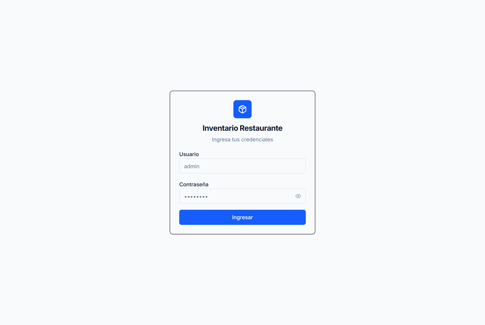

---

## 3. Pantalla principal (Dashboard)

**Propósito:** ver de un vistazo el estado del inventario.
**Quién:** todos los usuarios con acceso.

**Qué muestra:**
- **Tarjetas de resumen:** productos activos, alertas de stock, entradas y salidas del día.
- **Stock bajo mínimo:** lista de productos que necesitan reposición.
- **Movimientos recientes:** últimos registros de entradas/salidas/ajustes.

**Resultado esperado:** un panorama actualizado; los enlaces "Ver todos" y "Ver historial"
llevan a Alertas y a Movimientos.
**Recomendación:** revíselo al iniciar la jornada.

---

## 4. Productos

### 4.1 Ver productos

**Propósito:** consultar el catálogo y el stock actual.
**Quién:** todos los usuarios con acceso.
**Pasos:** menú **Productos**. Puede combinar tres filtros:
- **Buscar producto:** escriba parte del nombre.
- **Categoría:** desplegable "Todas las categorías" para acotar a una categoría.
- **Estado:** pestañas **Todos / Activos / Inactivos**.

A la derecha se muestra el **total de productos** que cumplen el filtro. La lista está
**paginada**: cuando hay muchos productos, use los controles de **página** al final de la
tabla para avanzar o retroceder. Los filtros y la página en la que está **se conservan**
aunque entre a un producto y vuelva.

**Resultado esperado:** lista con nombre, categoría, stock y estado (**En stock**, **Bajo
mínimo**, **Sin stock**). Cada fila incluye accesos rápidos para **editar**,
**activar/desactivar** y **eliminar** (según sus permisos).

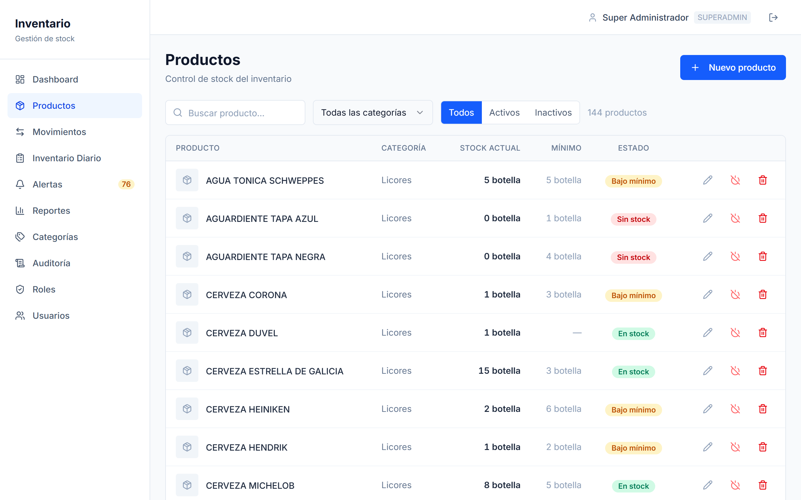

En **celular**, el listado se muestra como tarjetas (una por producto) con sus acciones:

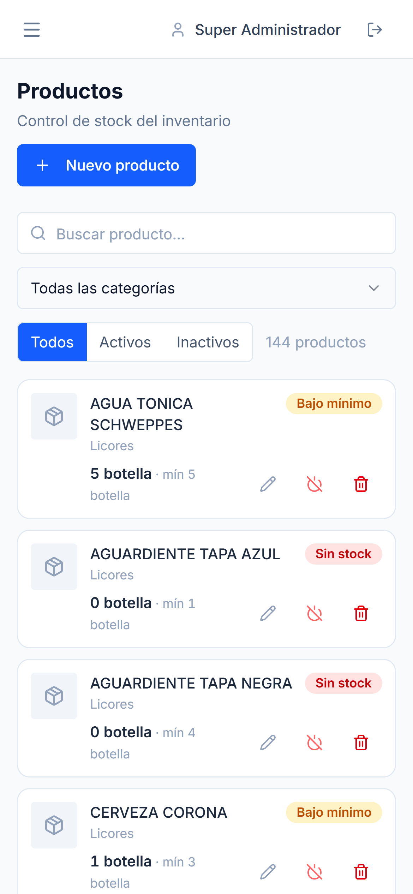

### 4.2 Crear un producto

**Propósito:** dar de alta un producto nuevo.
**Quién:** Superadmin (o rol con permiso "Crear productos").

**Pasos:**
1. Menú **Productos** → **Nuevo producto**.
2. Complete los campos del formulario:
   - **Nombre** *(obligatorio)*: cómo identifica el producto (por ejemplo, "Cerveza Corona").
   - **Unidad de medida** *(obligatorio)*: cómo lo cuenta (unidad, botella, kg, caja, litro…).
   - **Categoría** *(obligatorio)*: el área/subcategoría a la que pertenece.
   - **Stock mínimo** *(opcional)*: cantidad por debajo de la cual quiere recibir alerta de
     reposición. Si lo deja vacío, el producto no generará alerta por mínimo.
   - **Imagen** *(opcional)*: una foto para reconocerlo más fácil.
3. **Guardar**.

**Datos requeridos:** nombre, unidad y categoría.
**Resultado esperado:** el producto aparece en el listado.
**Errores / situaciones comunes:** faltan datos obligatorios; sin permiso (no verá el botón).
**Recomendación:** defina un **stock mínimo** realista para recibir alertas útiles de
reposición.

> **Consejo:** si su negocio tiene activado el **control por nivel de botella**, los productos
> de la subcategoría correspondiente (p. ej. licores de coctelería) no se cuentan por número
> exacto sino por nivel de botella. Ver [§7](#7-control-por-nivel-de-botella-opcional).

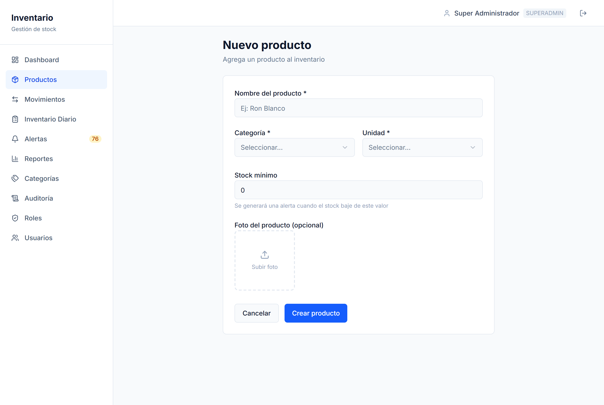

### 4.3 Editar, activar/desactivar y eliminar

**Quién:** editar → permiso "Editar productos"; activar/desactivar → "Activar/desactivar";
borrado permanente → "Borrado permanente".
**Pasos:** menú **Productos** → seleccione el producto → **Editar**; o use las acciones de
la fila para activar/desactivar.
**Resultado esperado:** los cambios se reflejan de inmediato. **Desactivar** oculta el
producto de las operaciones sin borrar su historial. El **borrado permanente** solo es
posible si el producto **no** tiene historial de movimientos.
**Recomendación:** prefiera **desactivar** en vez de borrar para conservar la trazabilidad.

---

## 5. Movimientos de stock

**Propósito:** registrar entradas, salidas y ajustes de stock.
**Quién:** usuarios con permiso "Registrar movimientos" (Empleado, Admin, Superadmin o rol
equivalente). Los **ajustes** requieren además el permiso "Ajustar stock".

**Registrar una entrada o salida — pasos:**
1. Menú **Movimientos**.
2. Busque y seleccione el **producto** (verá su stock actual).
3. Elija el tipo: **Entrada** (compra/ingreso) o **Salida** (consumo/merma/venta).
4. Escriba la **cantidad** y, si desea, **observaciones**.
5. Presione **Registrar movimiento**.

**Datos requeridos:** producto, tipo y cantidad.
**Resultado esperado:** el stock se actualiza y aparece un aviso con el nuevo valor.

**Ejemplos prácticos:**

| Situación | Tipo | Cantidad | Observación sugerida |
|---|---|---|---|
| Llegó una compra de 24 cervezas | Entrada | 24 | "Compra proveedor X" |
| Se rompieron 2 botellas | Salida | 2 | "Merma — rotura" |
| Se vendió/consumió 1 caja | Salida | 1 | "Consumo del día" |
| Un conteo físico dio 3 de más | Ajuste | +3 | "Corrección tras conteo" |

**Registrar un ajuste:** elija **Ajuste** e ingrese un valor **positivo** para aumentar o
**negativo** para disminuir (útil tras un conteo físico). Requiere el permiso "Ajustar
stock". Deje siempre una observación con el motivo.

> **Entrada vs. Ajuste:** use **Entrada/Salida** para movimientos reales de mercancía (compras,
> consumos, mermas) y **Ajuste** solo para **corregir** el stock cuando el sistema no coincide
> con lo físico. Así el historial refleja lo que de verdad pasó.

**Ver el historial:** **Movimientos** → **Historial**. Filtre por producto, tipo y rango de
fechas.

**Errores / situaciones comunes:**
- *Stock insuficiente:* no se puede sacar más de lo que hay.
- *Cantidad inválida:* debe ser mayor que 0.

**Recomendación:** registre los movimientos en el momento para que el stock refleje siempre
la realidad.

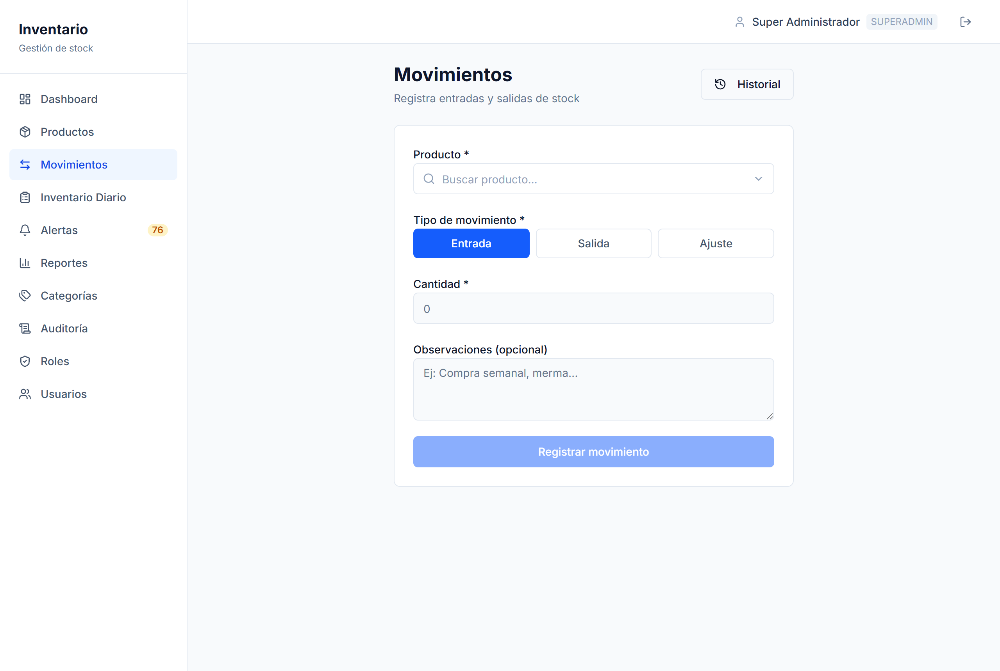

En **celular**, el formulario se apila en vertical para facilitar el registro con el dedo:

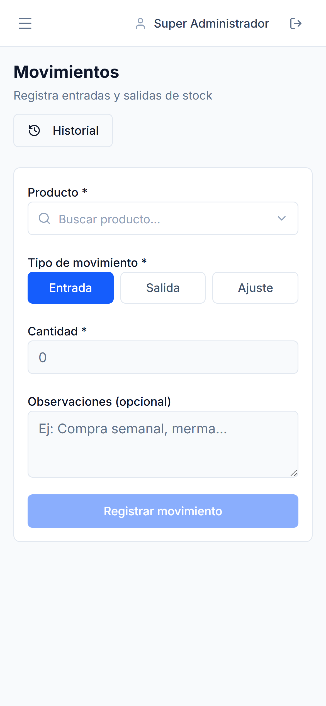

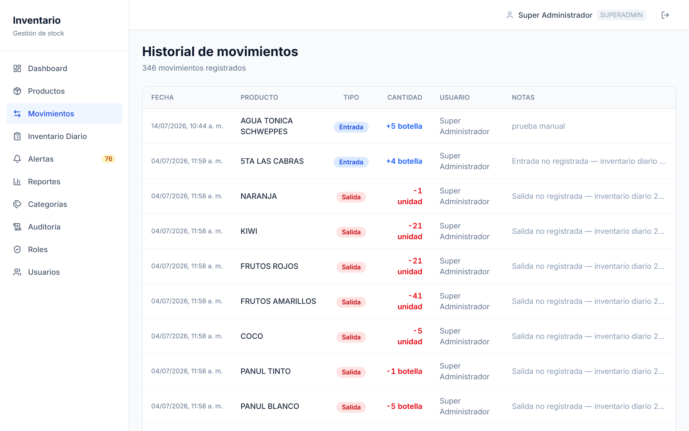

---

## 6. Inventario diario

> Disponible solo si su instalación tiene activada esta función.

**Propósito:** hacer el conteo del día por área (categoría), detectando diferencias entre el
stock del sistema y el conteo físico real.
**Quién:** usuarios con permiso para la categoría (típicamente Empleado, Admin, Superadmin).
**Reabrir, editar o descartar** una jornada requiere un permiso adicional ("Reabrir/editar").

**Cada categoría muestra su estado del día:** *Sin iniciar*, *En curso* o *Cerrado*.

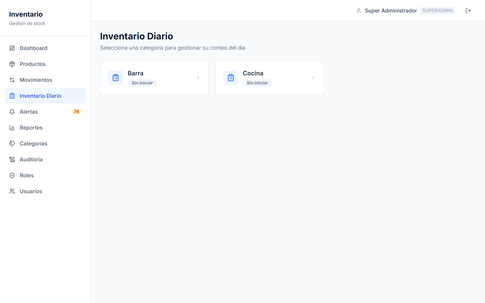

### 6.1 Abrir la jornada (conteo inicial)

1. Menú **Inventario Diario**.
2. Elija la **categoría** (por ejemplo, Barra o Cocina en un restaurante; Bebidas o Abarrotes
   en una tienda).
3. En **Conteo inicial del día**, ingrese las existencias físicas de cada producto. Los
   campos vacíos o en cero se registran como sin existencias (0).
4. Confirme.

> **Atajo "Mantener igual al cierre de ayer":** copia como conteo inicial el último estado
> registrado de cada producto. Útil los días sin movimiento; luego solo corrija lo que cambió.

> **Fracciones:** en los conteos puede escribir cantidades fraccionarias, por ejemplo `1/2`,
> `7 1/2` o `0.5` (media unidad). Es útil para productos que no siempre están completos.

En **celular**, cada producto se cuenta en su propia tarjeta:

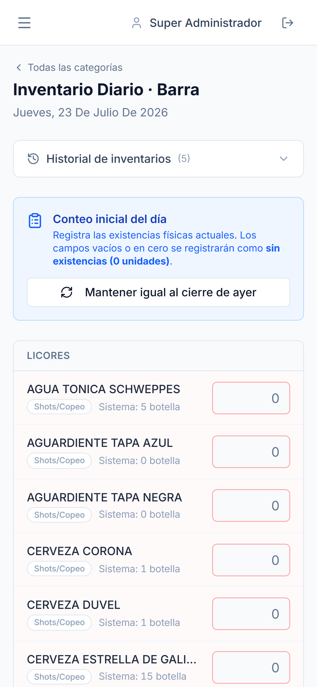

### 6.2 Cerrar la jornada (conteo final)

Con la jornada **En curso**, cada producto muestra una fila con:

- **Inicial:** lo que había al abrir.
- **+ Entradas reg.** y **− Salidas reg.:** los movimientos que sí se registraron en el día.
- **Entrada NR / Salida NR:** entradas o salidas **no registradas** como movimiento. Si las
  deja **vacías**, el sistema las calcula solo, a partir de la diferencia entre el conteo real
  y el esperado.
- **Esperado:** lo que *debería* haber = **Inicial + Entradas registradas − Salidas
  registradas** (cuenta solo los movimientos ya registrados, no las NR). Es la referencia
  contra la que se compara su conteo físico.
- **Conteo real:** lo que usted cuenta físicamente al cierre.

Pasos: ingrese el **conteo real** de cada producto (y, si aplica, las entradas/salidas NR con
su motivo) → presione **Cerrar**. Si el conteo real difiere del esperado, el sistema ajusta el
stock automáticamente y deja registro.

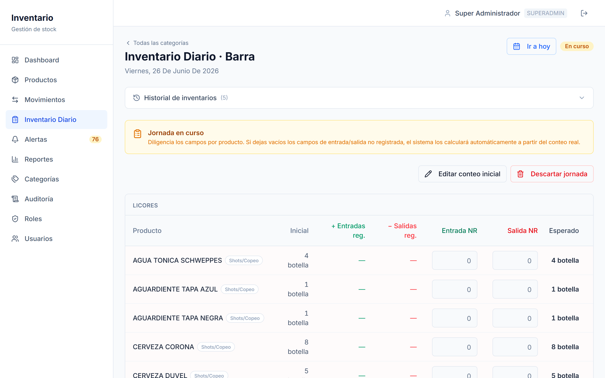

### 6.3 Corregir una jornada abierta: editar o descartar el conteo inicial

Si al **abrir** se equivocó en el conteo inicial, no hace falta esperar a cerrar. Con la
jornada **En curso** aparecen dos botones (requieren el permiso "Reabrir/editar" de la
categoría, o un rol administrador):

- **Editar conteo inicial:** vuelve a la pantalla de conteo inicial para corregir los valores
  con los que abrió la jornada.
- **Descartar jornada:** elimina por completo la jornada del día (como si no se hubiera
  abierto), para empezar de cero. Úselo con cuidado.

### 6.4 Reabrir una jornada cerrada

Abra la jornada **cerrada** → **Reabrir** → indique el **motivo**. Requiere el permiso
"Reabrir/editar". La jornada vuelve a estar editable y deja constancia de **quién** y **por
qué** la reabrió.

**Errores / situaciones comunes:** faltan el motivo/hora de una entrada no registrada; sin
permiso para reabrir/editar/descartar.
**Recomendación:** haga el conteo con el área cerrada para evitar movimientos mientras cuenta.

### 6.5 Indicador "Shots/Copeo" (licores y vinos)

En las subcategorías de **Licores** y **Vinos**, cada producto muestra un interruptor
**Shots/Copeo**. Actívelo en las botellas que se venden **por copa/trago** (no por botella
completa). Es una **marca informativa** que se guarda con la jornada; ayuda a distinguir esas
botellas al contar y no cambia el cálculo de stock.

---

## 7. Control por nivel de botella (opcional)

> Función opcional, útil para negocios que manejan **productos embotellados** que no se
> cuentan por unidad exacta (por ejemplo, licores en un bar o restaurante). Se activa por
> configuración y aplica a los productos de la subcategoría bajo seguimiento.

**Propósito:** controlar productos embotellados que duran varias semanas **sin** medir
cantidades exactas: se registra el **nivel de la botella abierta** y cuántas **botellas de
reserva** hay.
**Quién:** igual que Movimientos e Inventario diario.

**Cómo se registra:**
- **Nivel de la botella abierta:** seleccione uno de los 5 estados —
  **Llena → 3/4 → Mitad → 1/4 → Casi vacía**.
- **Botellas en reserva:** cuente las botellas cerradas disponibles (`− / +`).
- **Vaciar:** al marcar la botella abierta como vacía, si hay reserva se "destapa" una nueva
  automáticamente (reserva −1, nivel Llena).
- En el **inventario diario**, el botón **"Mantener igual"** copia el último estado
  registrado (útil los días sin movimiento).

**Resultado esperado:** el sistema calcula las **botellas disponibles** (reserva + 1 si hay
botella abierta con contenido) y avisa cuándo comprar.
**Recomendación:** configure el **umbral de alerta** del producto si desea que avise antes de
llegar a "Casi vacía".

---

## 8. Alertas y lista de compras

**Propósito:** ver qué hay que reponer.
**Quién:** todos los usuarios con acceso.

**Qué incluye:**
1. **Productos bajo mínimo:** su stock es menor o igual al mínimo definido.
2. **Productos embotellados por reponer** (si la función está activa): botella en el umbral
   de alerta y **sin** reserva.

**Pasos:** menú **Alertas**. Use **Copiar lista de compras** para llevar la lista al celular
o pegarla en un chat/nota.
**Resultado esperado:** listado claro de lo que falta; si todo está en orden, se indica.
**Recomendación:** revise las alertas antes de hacer el pedido a proveedores.

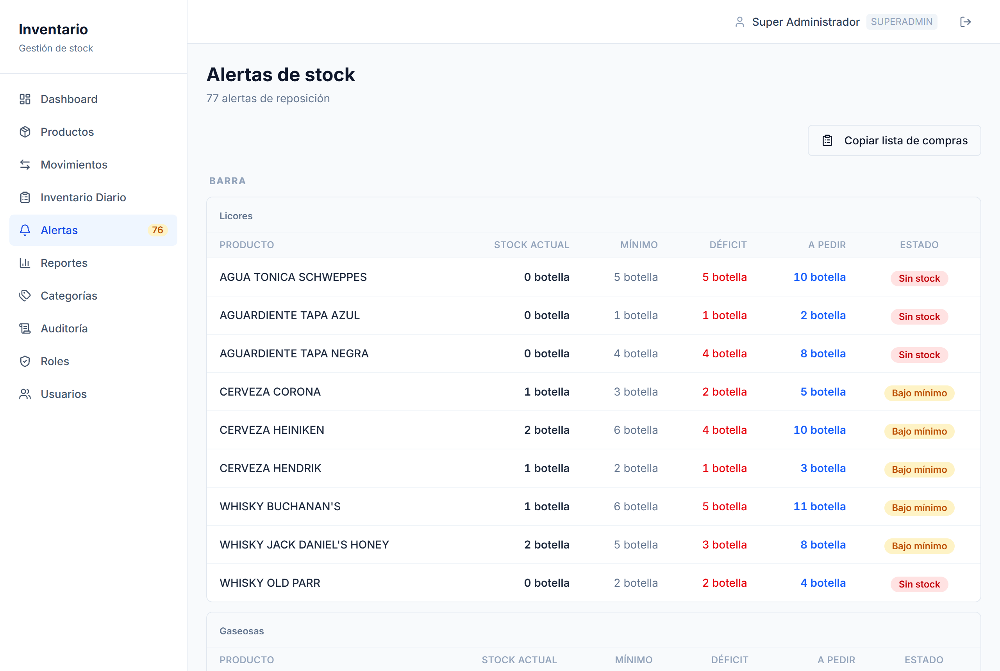

En **celular**, la lista de reposición se muestra como tarjetas por producto:

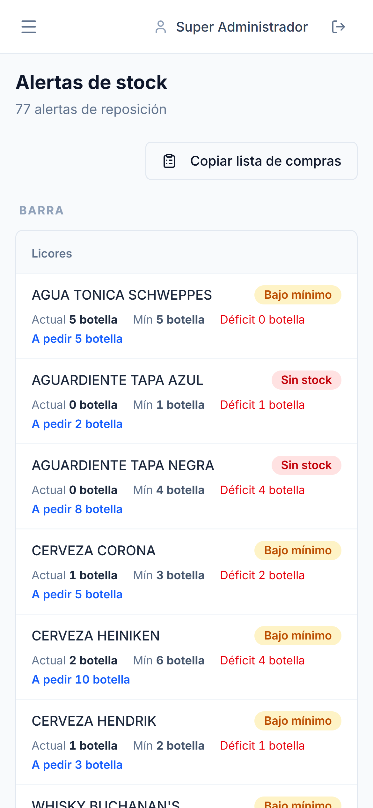

---

## 9. Reportes

**Propósito:** analizar movimientos y stock por período.
**Quién:** usuarios con permiso "Ver reportes" (Admin, Superadmin o rol equivalente).

**Pasos:**
1. Menú **Reportes**.
2. Elija el período: **Semana**, **Quincena**, **Mes** o **Histórico**. Puede filtrar por
   categoría y por estado (activos/inactivos).

**Resultado esperado:** por cada producto verá el **stock inicial** del período, las
**entradas**, las **salidas** y el **stock actual**.
**Recomendación:** use el reporte **mensual** para evaluar consumo y planear compras.

---

## 10. Auditoría

**Propósito:** revisar el historial de acciones sensibles (quién abrió/cerró/reabrió
inventarios, creó categorías, o intentos de acceso denegado).
**Quién:** usuarios con permiso "Ver auditoría" (Admin, Superadmin o rol equivalente).

**Pasos:** menú **Auditoría**. Filtre por **acción**, **usuario**, **resultado**, texto o
**rango de fechas**.
**Resultado esperado:** tabla con fecha, acción, categoría, usuario, detalle y resultado
(OK / Denegado).

**Nota:** los registros se conservan **6 meses**.

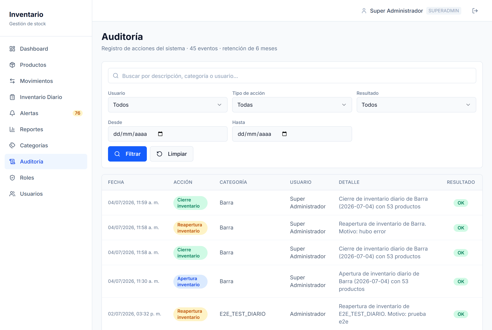

---

## 11. Mi perfil

> Disponible en el modo con login propio (standalone).

**Propósito:** actualizar sus datos y su contraseña.
**Quién:** cualquier usuario autenticado.
**Pasos:** abra **Perfil** → edite su **nombre de usuario** y/o **contraseña** → **Guardar**.
**Recomendación:** use una contraseña robusta y cámbiela periódicamente.

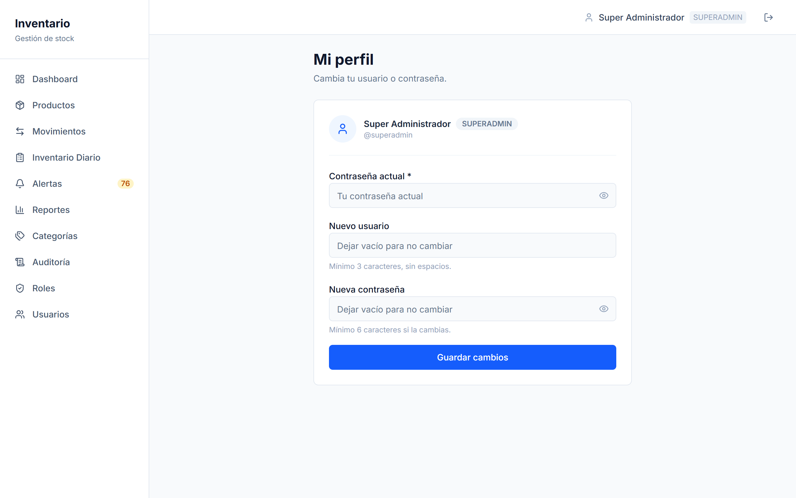

---

## 12. Categorías

**Propósito:** organizar los productos en categorías (por área, tipo o ubicación) y
subcategorías.
**Quién:** usuarios con permiso "Gestionar categorías" (típicamente Superadmin).

**Pasos:**
1. Menú **Categorías** → **Nueva categoría** (raíz o subcategoría de una existente).
2. Escriba el **nombre** y **Guardar**. Puede reordenarlas según el orden físico de su
   inventario.

**Datos requeridos:** nombre.
**Resultado esperado:** la categoría queda disponible al crear/editar productos y en el
inventario diario.
**Recomendación:** defina la estructura de categorías al inicio y evite duplicados.

**Nota:** al crear una categoría **raíz** se generan automáticamente sus permisos de
inventario diario. Renombrar una categoría **no** cambia su identificador interno.

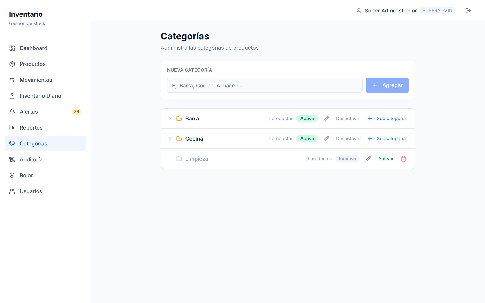

---

## 13. Usuarios

> Disponible solo en el modo con login propio (standalone).

**Propósito:** crear y gestionar las cuentas de acceso al sistema.
**Quién:** usuarios con permiso "Gestionar usuarios" (Superadmin).

**Crear un usuario — pasos:**
1. Menú **Usuarios** → **Nuevo usuario**.
2. Complete **usuario**, **nombre**, **contraseña** y **rol base**.
3. Opcional: asigne un **rol personalizado** y ajuste **permisos individuales**
   (conceder/revocar) por acción.
4. **Guardar**.

**Datos requeridos:** usuario, contraseña y rol base.
**Resultado esperado:** la persona ya puede iniciar sesión con los permisos resultantes.
**Otras acciones:** editar, activar/desactivar y restablecer contraseñas.

**Errores / situaciones comunes:** nombre de usuario repetido (debe ser único); los cambios
de rol/permisos aplican de inmediato en standalone.
**Recomendación:** asigne el **rol más restrictivo** que permita el trabajo de la persona.

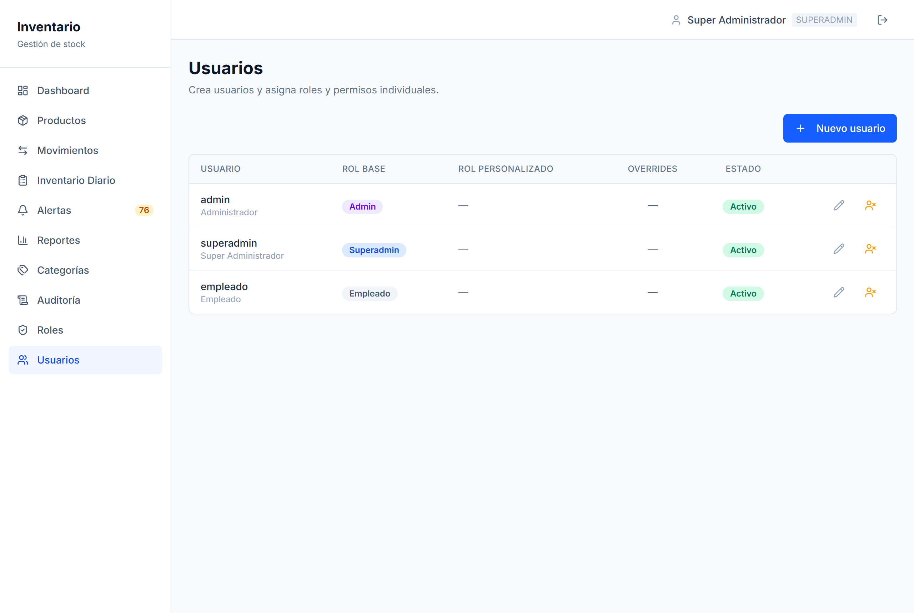

---

## 14. Roles y permisos

> Disponible solo en el modo con login propio (standalone).

**Propósito:** definir **roles personalizados** como conjuntos de permisos reutilizables, para
no depender solo de los roles base.
**Quién:** usuarios con permiso "Gestionar usuarios" (Superadmin).

**Crear un rol — pasos:**
1. Menú **Roles** → **Nuevo rol**.
2. Escriba **nombre** y descripción.
3. Marque los **permisos** por grupo (General, Operación, Productos, Admin).
4. **Guardar**. Luego asígnelo a un usuario desde **Usuarios**.

**Datos requeridos:** nombre y selección de permisos.
**Resultado esperado:** el rol queda disponible; un usuario con ese rol usa exactamente esos
permisos (reemplaza a su rol base).
**Recomendación:** cree roles por función real del negocio (por ejemplo, "Encargado de
bodega") en vez de dar permisos sueltos a cada usuario.

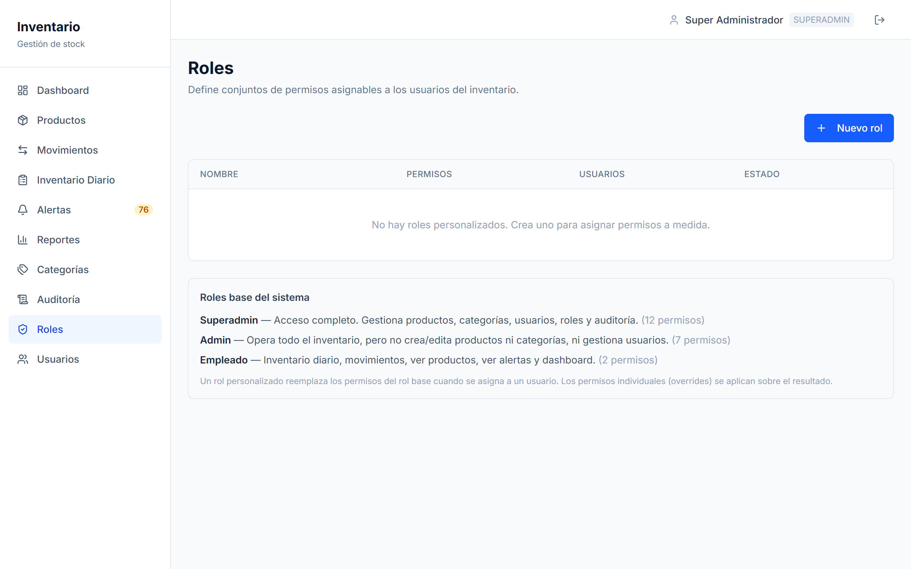

---

## 15. Cerrar sesión

**Modo con login propio:** use la opción **Cerrar sesión** del encabezado (icono arriba a la
derecha, junto a su nombre).
**Modo integrado con Nómina:** use **Volver a Nómina** (la sesión se gestiona desde Nómina
Xpress).
**Recomendación:** cierre sesión al terminar, especialmente en equipos compartidos.

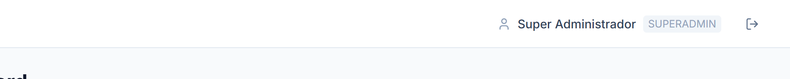

---

## 16. Uso en celular y tablet

El sistema es **responsive**: la misma dirección web funciona en computador, tablet y celular,
y la pantalla se **adapta** automáticamente al tamaño del dispositivo. No necesita instalar
ninguna app.

**Qué cambia en pantallas pequeñas (celular):**

- El **menú lateral** se oculta y aparece un botón de **menú** (icono ☰) arriba a la izquierda;
  tóquelo para abrir las secciones.
- Las **tablas** (productos, movimientos, inventario diario) se muestran como **tarjetas**
  apiladas: cada producto ocupa su propia tarjeta con su nombre y sus campos en vertical, más
  fáciles de tocar y llenar con el dedo.
- Los botones y campos crecen para facilitar el toque; el contenido se desplaza en vertical.

**Recomendación:** para el **conteo del inventario diario** en el piso del negocio, el celular
es cómodo (una tarjeta por producto). Para **reportes** y tareas de administración
(usuarios, roles, categorías) se ve mejor en tablet horizontal o computador.

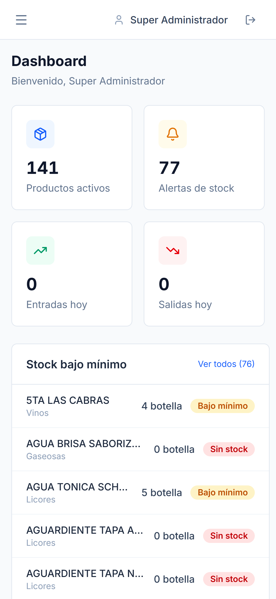

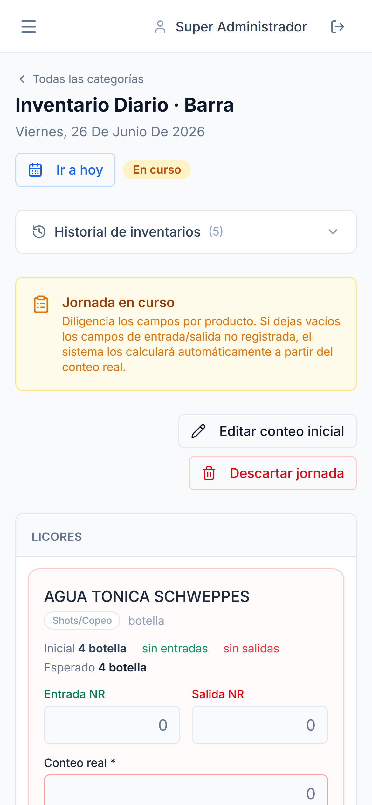

---

## 17. Consejos y buenas prácticas

- **Registre en el momento.** Anote entradas y salidas cuando ocurren; así el stock del
  sistema siempre refleja la realidad y las alertas son confiables.
- **Defina stocks mínimos realistas.** Un mínimo bien puesto hace que las alertas le avisen a
  tiempo, ni de más ni de menos.
- **Prefiera desactivar antes que borrar.** Desactivar conserva el historial; el borrado
  permanente solo conviene para productos creados por error y sin movimientos.
- **Haga el conteo con el área quieta.** Cierre el ingreso/salida de mercancía mientras cuenta
  para que el conteo físico no cambie a mitad de camino.
- **Use Ajuste solo para corregir.** Los movimientos reales van como Entrada/Salida; el Ajuste
  es para cuadrar diferencias tras un conteo.
- **Revise las alertas antes de comprar.** La sección *Alertas* y su botón *Copiar lista de
  compras* le arma el pedido en segundos.
- **Cuide sus credenciales.** Cambie la contraseña inicial, no la comparta y cierre sesión en
  equipos compartidos.
- **Asigne el rol más restrictivo** que permita a cada persona hacer su trabajo.

---

## 18. Glosario de términos

| Término | Significado |
|---|---|
| **Stock actual** | Cantidad que el sistema cree que hay de un producto en este momento. |
| **Stock mínimo** | Cantidad de referencia: si el stock actual baja de aquí, se genera una alerta. |
| **Movimiento** | Cada entrada, salida o ajuste que cambia el stock, con registro de quién y cuándo. |
| **Entrada / Salida** | Ingreso (compra) o egreso (consumo, merma, venta) real de mercancía. |
| **Ajuste** | Corrección manual del stock para cuadrarlo con el conteo físico. |
| **Inventario diario** | Conteo del día por área (categoría) que compara lo físico con el sistema. |
| **Esperado** | Lo que *debería* haber al cierre = inicial + entradas registradas − salidas registradas. |
| **Entrada/Salida NR** | Entrada o salida "no registrada" como movimiento durante el día; se anota al cerrar. |
| **Jornada** | Una sesión de inventario diario de una categoría en una fecha (abierta o cerrada). |
| **Reabrir** | Volver a dejar editable una jornada ya cerrada (deja constancia del motivo). |
| **Botella / Reserva** | En control por nivel de botella: la botella abierta y las botellas cerradas de repuesto. |
| **Shots/Copeo** | Marca informativa para licores/vinos que se venden por copa/trago. |
| **Rol** | Conjunto de permisos que define qué puede ver y hacer un usuario. |
| **Alerta** | Aviso de que un producto necesita reposición (bajo mínimo o sin reserva). |

---

## 19. Preguntas frecuentes

**No veo una opción en el menú.**
Su rol no tiene ese permiso, o la función no está activada en su instalación. Consulte con el
administrador.

**Cambié permisos de un usuario y no se reflejan.**
En el modo con login propio aplican de inmediato. En el modo integrado con Nómina, el usuario
debe **cerrar sesión y volver a entrar**.

**No puedo registrar una salida.**
Verifique que haya stock suficiente; el sistema no permite dejar el stock por debajo de 0.

**¿Por qué un producto embotellado no aparece en alertas aunque está casi vacío?**
Porque tiene **botellas de reserva**. Solo alerta cuando no queda reserva.

**Necesito corregir un inventario ya cerrado.**
Pida a alguien con permiso "Reabrir/editar" que lo reabra; deberá indicar un motivo.

**Me equivoqué en el conteo inicial y la jornada sigue abierta.**
Con la jornada **En curso**, use **Editar conteo inicial** para corregir los valores, o
**Descartar jornada** para eliminarla y empezar de cero. Ambas requieren el permiso
"Reabrir/editar" de la categoría (o un rol administrador).

**¿Puedo registrar medias unidades o fracciones en el conteo?**
Sí. En los conteos del inventario diario puede escribir cantidades como `1/2`, `7 1/2` o
`0.5`.

**¿Qué significa la marca "Shots/Copeo" en licores y vinos?**
Indica que esa botella se vende por copa/trago. Es informativa (ayuda al conteo) y no altera
el cálculo de stock.

**¿Para qué tipo de negocio sirve el sistema?**
Para cualquiera que necesite controlar existencias de insumos o productos: tiendas, bodegas,
minimercados, farmacias, bares, restaurantes, cafeterías, etc. Las categorías y unidades se
configuran según su negocio.
